# SUDO KILL MEETINGS

Un marco de trabajo cognitivo y asíncrono para aniquilar la cultura de reuniones corporativas mediante Obsidian Canvas.

Las reuniones tradicionales son fallos de arquitectura organizacional. Fomentan el sesgo de supervivencia, castigan a los perfiles analíticos y destruyen el tiempo de enfoque profundo. Este repositorio contiene 20 plantillas deterministas que sustituyen las interacciones síncronas ineficientes por un modelo matemático, visual y asíncrono.

## LA HIPER-OPTIMIZACIÓN COGNITIVA (EL PROTOCOLO IA)

Estas plantillas no son simples pizarras en blanco. Han sido diseñadas inyectando paradigmas nativos de los Modelos de Lenguaje (LLMs) directamente en la psicología del equipo humano:

1. **Graph of Thoughts (El Multiverso de Hipótesis):** Sustituye el pensamiento lineal. Cada tarjeta de participante exige ramificación: plantear una hipótesis, plantear simultáneamente su escenario inverso, y realizar una fusión lógica (Path Merging) antes de tomar decisiones.
2. **Dialéctica Adversarial (El Coliseo Sintético):** Cada plantilla incluye un espacio oscuro obligatorio. Contiene un prompt diseñado para que una IA actúe como un "Agente Antítesis", cuya única directiva es destruir matemáticamente la hipótesis más popular del lienzo para forzar una Síntesis indestructible.
3. **Vectores de Tensión Ortogonal:** Las flechas de interconexión no solo fluyen; también colisionan. El sistema exige marcar dependencias rojas de exclusión mutua. No puedes priorizar A sin destruir B.
4. **Percepción Gestalt (Compresión Topológica):** El debate no termina en un acta difusa. El último nodo es un prompt diseñado para que un LLM tome todo el problema corporativo y lo traduzca a un sistema físico o biológico, extrayendo una solución holística (Gestalt) en un hash ejecutivo de 50 palabras.

## ARQUITECTURA DEL LIENZO (VISUALIZACIÓN DE FLUJO)

El siguiente diagrama representa la lógica de renderizado cognitivo utilizada en las 20 plantillas:

```mermaid
flowchart TD
    subgraph FASE 0: CONTEXTO Y PROBLEMA ANCLA
        A[Problema Cuantificable o Iniciativa]
    end

    subgraph FASE 1: GRAPH OF THOUGHTS
        B[Hipótesis A + Inversa \n Path Merging]
        C[Hipótesis B + Inversa \n Path Merging]
        O{El Coliseo Adversarial \n Tesis vs Antítesis}
    end

    subgraph FASE 2: CONVERGENCIA Y ACCIÓN
        D[Ítem de Acción Táctica 1]
        E[Ítem de Acción Táctica 2]
        H{Síntesis Gestalt \n Analogía Topológica}
    end

    A --> B
    A --> C
    O -. Fricción Excluyente .-> A
    B --> D
    C --> E
    D --> H
    E --> H

    style A fill:#2d1b19,stroke:#e03131
    style B fill:#1e1e1e,stroke:#f08c00
    style C fill:#1e1e1e,stroke:#f08c00
    style O fill:#111111,stroke:#a6a7ab,stroke-width:2px,stroke-dasharray: 5 5
    style D fill:#152b1d,stroke:#2f9e44
    style E fill:#152b1d,stroke:#2f9e44
    style H fill:#1e1b30,stroke:#845ef7,stroke-width:2px
```

## CATÁLOGO DE LAS 20 PLANTILLAS

1. **Filtro de Intención Asíncrono:** Kick-offs preliminares.
2. **Desglose de Fricción Operativa:** Deuda técnica y riesgos.
3. **Planificación de OKRs:** Alineación de métricas trimestrales.
4. **Aprobación de Presupuesto:** Defensa de compras y ROI.
5. **Daily Standup Visual:** Actualizaciones centradas en bloqueadores.
6. **Estado a Stakeholders:** Reportes ejecutivos sin llamadas.
7. **Refinamiento de Backlog:** Casos borde y puntos de historia.
8. **Análisis de Competencia:** Mapas de mercado tácticos.
9. **Post-Mortem Blameless:** Análisis causal mediante Graph of Thoughts.
10. **Revisión de Arquitectura RFC:** Decisiones técnicas y ADRs.
11. **Auditoría de Seguridad:** Mapeo de vectores de amenaza.
12. **Evaluación de Herramientas:** Matrices de decisión tras pruebas reales.
13. **Retrospectiva de Sprint:** Start/Stop/Continue dialéctico.
14. **Debriefing de Contratación:** Evaluaciones a ciegas.
15. **Onboarding Visual:** Misiones progresivas para nuevos ingresos.
16. **Radar de Burnout:** Diagnósticos tempranos de salud del equipo.
17. **Crítica de Diseño UX:** Validaciones no subjetivas de prototipos.
18. **Crazy 8s Async:** Brainstorming y divergencia de innovación.
19. **Planificación Go-To-Market:** Checklists unánimes pre-lanzamiento.
20. **Cierre de Proyecto:** Lecciones aprendidas y traspasos documentados.

## USO
Clona este repositorio o descarga los archivos `.canvas` directamente a tu bóveda local de Obsidian. No requieren dependencias, bases de datos ni conexión a internet.
